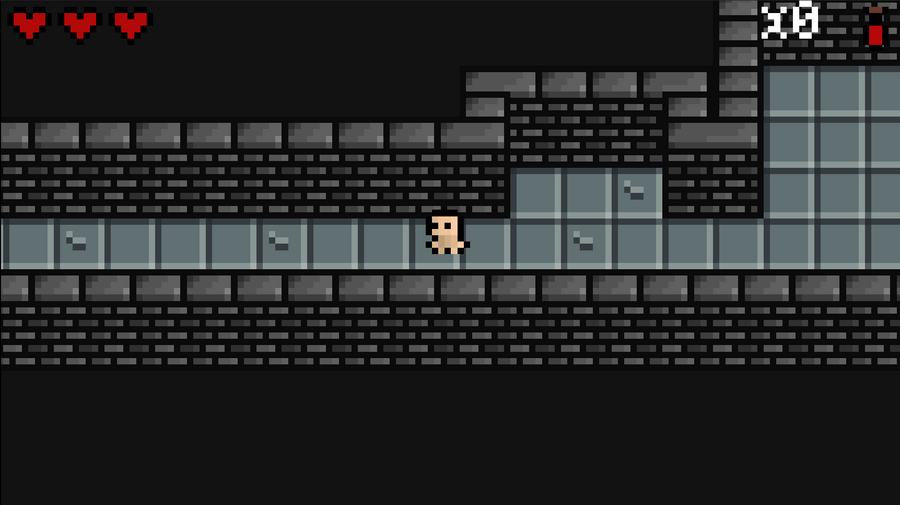

# Madness of Warblade

A short 2D dungeon crawler. Once it's finished, the game will be uploaded to itch.io.

## Table of contents

- [Overview](#overview)
  - [The goal](#the-goal)
  - [Screenshot](#screenshot)
  <!-- - [Links](#links) -->
- [My process](#my-process)
  - [Built with](#built-with)
  - [What I learned](#what-i-learned)
  - [Continued development](#continued-development)
  - [Useful resources](#useful-resources)
- [Author](#author)
- [Asset credits](#asset-credits)
- [Acknowledgments](#acknowledgments)

## Overview

### The goal

Building a short game with a combat system, animations, sound effects, and linear storyline.

### Screenshot

<!-- ### Links

- Play the game: [Itch.io](https://your-solution-url.com) -->

## My process

### Built with

- Godot 3.5.1
- LibreSprite
- Assets from itch.io

### What I learned

This project's an implementation of everything I've learned about both Godot 3.x and game design so far. Everything from the more technical stuff about creating animations, pathfinding, enemy AI etc. to designing art, levels, and menus.

### Continued development

In future projects, I want to focus more on making the combat more fun, as well as implement various weapon/stat upgrades and a save option. Making a side scroller with high scores also seems like a fun idea.

### Useful resources

- [HeartBeast's YouTube channel](https://www.youtube.com/@uheartbeast) is a great source for Godot tutorials
- [AdamCYounis's videos](https://www.youtube.com/@AdamCYounis) were incredibly helpful in understanding the basics of pixel art to make a few of my own sprites

## Author

- Website - [Maijs Garais](https://mai-soup.github.io/)
- Mastodon - [@maijs@social.linux.pizza](https://social.linux.pizza/@maijs)

## Asset credits

- (The majority of) sprites, music, SFX - [Minifantasy - Dungeon by Krishna Palacio](https://krishna-palacio.itch.io/minifantasy-dungeon)
- Font - [Quaver by Nathan Scott](https://caffinate.itch.io/quaver)

## Acknowledgments

Special thanks to the following game dev youtubers for making me want to try game dev out for myself and learn a lot of new things:

- [DevDuck](https://www.youtube.com/channel/UCKCTmact-90hXpV2ns8GSsA)
- [BenBonk](https://www.youtube.com/@BenBonk)
- [Blackthornprod](https://www.youtube.com/@Blackthornprod)
- [Game Endeavor](https://www.youtube.com/@GameEndeavor)
- [Jonas Tyroller](https://www.youtube.com/@JonasTyroller)
- [Miziziziz](https://www.youtube.com/@Miziziziz)
- [Vimlark](https://www.youtube.com/@Vimlark)
- There was also an Estonian streamer on Twitch who was coding an RPG in Unity months (possibly years?) ago, I can't for the life of me find his channel anymore but I remember it being my first experience actually watching a game be made in front of me.
